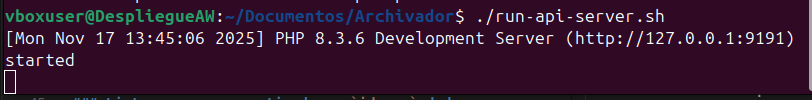
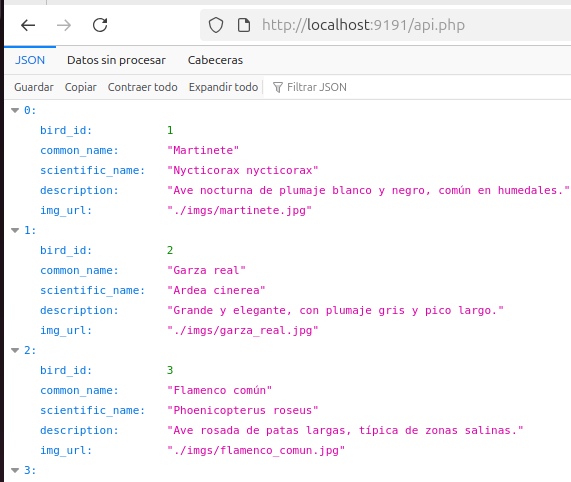
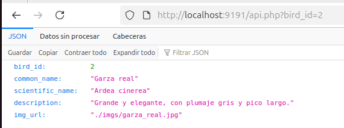

# Albuaves

Albuaves es un pequeño proyecto mascota ( *pet-project* ) , que pretende
de una manera sencilla plantear al alumnado todas las partes implicadas
en una Solución Software basada en la arquitectura *Cliente-Servidor*.

Por una parte tendremos una base de datos en `SQLite` que editaremos de manera
sencilla con `sqlitebrowser` y que usaremos como persistencia en el lado 
del servidor.

Serviremos una API Rest, programada en PHP, por ahora se plantea con dos únicas
funciones: 


## Software Requerido

* sqlitebrowser
* php-sqlite3

### Comandos para la instalación en máquinas de desarrollo

```bash
sudo apt update; sudo apt install sqlitebrowser php-sqlite3;  sudo apt-get install openjdk-17-jre;
```

## CONTENIDO DEL PROYECTO
- Dentro de este proyecto tenemos de manera ordenada una lista de carpetas con un significado:
    - **./db**: Carpeta donde contenemos la base de datos para acceder a las aves.
    - **./java**: Carpeta donde podriamos acceder mediante los archivos al listado de los aves mediante **SearchBirdsAPI.java** y **json-20250517.jar**.
    - **./php**: Carpeta donde contiene uno de los archivos importantes, **api.php** código cuya finalidad conecta y accede a la base de datos para imprimir en pantalla del navegador la lista de aves como resultado (accediendo desde lado servidor).
    - **./imgs**: Carpeta con las imagenes de las aves.
    - **./libs**: Carpeta donde tenemos librerías para exportar los datos de las aves.

## ¿CÓMO FUNCIONA?
- En este proyecto, depende del resultado que buscas, contiene diferentes importantes scripts. Pero, antes de todo, para realizar cualquier busqueda, debemos iniciar el servidor mediante su api. Por tanto, desde la carpeta principal, haremos:
```bash
    ./run-api-server.sh
```


- Luego, una vez iniciado, tenemos dos formas de acceder al listado de aves:
    ### Caso 1 - Terminal
    ```bash
    cd ./java
    javac -cp json-20250517.tar SearchBirdsAPI.java
    java -cp json-20250517.tar SearchBirdsAPI.java
    ``` 
    
    ### Caso 2 - Navegador
    ```bash
    http://localhost:9191/api.php
    ``` 
    

### Listar un ave a partir de un `id_ave` dado
- Ahora que sabemos como acceder a su lista completa, haremos un ejemplo de busqueda específica. En esta misma busqueda realizada del navegador, añadimos una pequeña parte para que la api consulte a la base de datos sobre ese registro pedido. Como ejemplo, buscaremos en la api la información del ave identificado por bird_id = 2:
```bash
http://localhost:9191/api.php?bird_api=2
```


## URLs de interés

### JSON.org

Podemos encontrar más información acerca de JSON.org en la página de 
GitHub del desarrollador principal.

https://github.com/stleary/JSON-java
